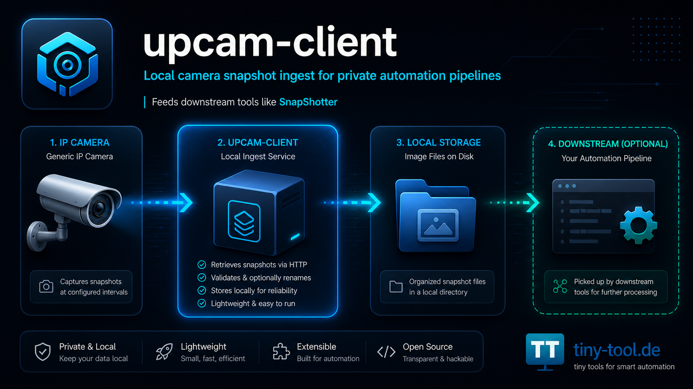

# 📷 upcam-client


Kamera-Ingest für lokale Snapshot-Verarbeitung – mit Unterstützung für UpCam-kompatible Kameras und Reolink-Snapshot-Endpunkte.

Camera ingest for local snapshot processing – supporting UpCam-compatible cameras and Reolink snapshot endpoints.

---



> Lokale Kamera-Snapshots abrufen, speichern und für die Weiterverarbeitung durch SnapShotter bereitstellen.  
> Local camera snapshots, persisted on disk and prepared for downstream processing by SnapShotter.

---

# Deutsche Dokumentation

## ⚠️ Wichtiger Hinweis

`upcam-client` ist ein privates Open-Source-Projekt für technisch versierte Nutzerinnen und Nutzer.

Das Projekt steht in keiner Verbindung zu UpCam, Reolink oder deren Herstellern, Markeninhabern, Tochterunternehmen oder Vertriebspartnern.

UpCam und Reolink sind Marken beziehungsweise Produktnamen ihrer jeweiligen Rechteinhaber. Die Nennung dient ausschließlich der technischen Beschreibung kompatibler oder getesteter Kameraquellen.

Produktiver Einsatz kann möglich sein, erfolgt aber immer eigenverantwortlich.

Konfiguration, Netzwerkfreigaben, Zugriffsdaten, Kamera-Sicherheit, Datenschutz, Speicherorte, Monitoring und Bewertung der erzeugten Bilddaten liegen beim jeweiligen Betreiber.

---

## Was ist upcam-client?

`upcam-client` ist eine Java-Anwendung, die Bilder von einer IP-Kamera abruft und lokal speichert.

Die gespeicherten Bilder können anschließend von anderen Komponenten verarbeitet werden – insbesondere von [`SnapShotter`](https://github.com/gzeuner/SnapShotter).

Kurz gesagt:

`upcam-client` holt die Bilder von der Kamera.  
`SnapShotter` bewertet die Bilder und kann passende Ereignisse weiterleiten.

---

## Zusammenspiel mit SnapShotter

Dieses Projekt ist der erste Baustein einer zweistufigen Pipeline:

```text
IP-Kamera
   ↓
upcam-client
   ↓
lokaler Bildordner
   ↓
SnapShotter
   ↓
Filterung / Ereigniserkennung / optionale WhatsApp-Benachrichtigung
```

### Aufgabe von upcam-client

`upcam-client` ist für den Kamera-Zugriff zuständig:

- Snapshot abrufen
- Bild lokal speichern
- optional Metadaten bereitstellen
- definierte Ordnerstruktur befüllen
- technische Grundlage für SnapShotter liefern

### Aufgabe von SnapShotter

`SnapShotter` ist für die nachgelagerte Verarbeitung zuständig:

- neue Bilder erkennen
- Bewegungs-/Änderungslogik anwenden
- irrelevante Frames aussortieren
- relevante Ereignisbilder optional per WhatsApp versenden
- Laufzeitstatus und Entscheidungen protokollieren

Beide Projekte können getrennt betrachtet werden, sind im praktischen Betrieb aber als gemeinsame Pipeline gedacht.

---

## Für wen ist dieses Projekt gedacht?

`upcam-client` richtet sich an Nutzerinnen und Nutzer, die:

- eine unterstützte IP-Kamera betreiben
- lokale Snapshot-Verarbeitung aufbauen möchten
- Bilder nicht direkt in eine Cloud schicken möchten
- eine eigene Automatisierung mit Java, Skripten oder SnapShotter betreiben möchten
- technische Konfigurationen selbst prüfen und verantworten können

Nicht geeignet ist das Projekt für Personen, die eine fertige Plug-and-play-Sicherheitslösung, eine zertifizierte Alarmanlage oder eine kommerzielle Überwachungslösung erwarten.

---

## Unterstützte Kameraquellen

Aktuell technisch vorgesehen:

- `UPCAM`
- `REOLINK`

Je nach Kameramodell, Firmware, Netzwerkkonfiguration und Snapshot-Endpunkt können Anpassungen notwendig sein.

---

## Was upcam-client nicht macht

`upcam-client` ist kein vollständiges Sicherheitssystem.

Die Anwendung:

- ersetzt keine Alarmanlage
- ersetzt keine professionelle Videoüberwachung
- bewertet keine Bewegung
- verschickt keine Nachrichten
- übernimmt keine Datenschutzprüfung
- garantiert keine Verfügbarkeit der Kamera
- garantiert keine Kompatibilität mit allen Firmware-Versionen
- ist keine offizielle Software von UpCam oder Reolink

Die Verantwortung für Betrieb, Datenschutz, Netzwerkzugriff und rechtmäßige Nutzung liegt beim Betreiber.

---

## Features

- Abruf von Kamera-Snapshots
- Unterstützung für konfigurierbare Kameraquellen
- lokale Speicherung von Einzelbildern
- vorbereitet für Weiterverarbeitung durch SnapShotter
- Konfiguration über Properties-Dateien
- Startskripte für Linux und Windows
- Maven-Build
- geeignet für lokale Heimautomatisierung und eigene Monitoring-Pipelines

---

## Voraussetzungen

- Java 21 oder höher
- Maven
- Netzwerkzugriff auf die Kamera
- lokale Schreibrechte für den Zielordner
- optional: SnapShotter für die Weiterverarbeitung

---

## Repository Setup

Repository klonen:

```bash
git clone https://github.com/gzeuner/upcam-client.git
cd upcam-client
```

Falls SnapShotter als Submodule eingebunden ist:

```bash
git clone --recurse-submodules https://github.com/gzeuner/upcam-client.git
```

Bei bereits geklontem Repository:

```bash
git submodule update --init --recursive
```

---

## Build

```bash
mvn clean package
```

Das Build erzeugt die ausführbare Java-Anwendung und bereitet die benötigten Laufzeitdateien vor.

---

## Installation

### Linux / macOS

```bash
./setup.sh
```

### Windows

```bat
setup.bat
```

Die Setup-Skripte bereiten einen lokalen Laufzeitordner vor.

Typische Zielpfade:

```text
Linux/macOS: ~/upcam
Windows:     %USERPROFILE%\upcam
```

---

## Start

### Linux

```bash
~/upcam/upcamclient.sh
```

### Windows

```bat
%USERPROFILE%\upcam\upcamclient.cmd
```

### Einzelner Ingest-Lauf

```bash
java -jar upcam-client-1.0-jar-with-dependencies.jar --once
```

---

## Konfiguration

Die Konfiguration erfolgt über Properties-Dateien.

Typisches Modell:

```text
application.properties                 tracked defaults
application.local.properties           lokale echte Konfiguration, nicht committen
application.local.properties.example   Vorlage
upcamclient.properties                 Legacy-kompatible Defaults
upcamclient.local.properties           lokale Legacy-Overrides
```

### Wichtig

Echte Zugangsdaten gehören niemals ins Repository.

Verwende für Passwörter, Tokens, lokale IP-Adressen und echte Kameradaten eine lokale Datei, zum Beispiel:

```text
application.local.properties
```

Diese Datei sollte nicht versioniert werden.

---

## Beispielkonfiguration: UpCam

```properties
camera.type=UPCAM

base.url=http://upcam.local
image.daily.root.resource=/sd/${day}

upcam.user.name=admin
upcam.user.pwd=change_me
```

---

## Beispielkonfiguration: Reolink

```properties
camera.type=REOLINK

reolink.host=reolink.local
reolink.httpPort=80
reolink.username=admin
reolink.password=change_me
reolink.snapshotPath=/cgi-bin/api.cgi?cmd=Snap&channel=0&rs={timestamp}
```

---

## Zielordner für SnapShotter

Damit SnapShotter die Bilder weiterverarbeiten kann, müssen die von `upcam-client` erzeugten Bilder in einem von SnapShotter überwachten Ordner landen.

Typisch ist zum Beispiel:

```text
./images/received/
```

Die konkrete Ordnerstruktur muss zur SnapShotter-Konfiguration passen.

---

## Sicherheit und Datenschutz

Beim Betrieb einer Kamera-Pipeline entstehen Bilddaten. Diese können personenbezogene Informationen enthalten.

Der Betreiber ist verantwortlich für:

- rechtmäßige Kameraausrichtung
- Datenschutz und Persönlichkeitsrechte
- Zugriffsschutz auf Kamera und Bildordner
- sichere Passwörter
- Netzwerksicherheit
- Löschkonzepte
- Protokollierung und Monitoring
- Prüfung, ob der konkrete Einsatz erlaubt ist

Dieses Projekt liefert nur technische Bausteine. Es ersetzt keine rechtliche oder fachliche Prüfung.

---

## Commit-Hygiene

Nicht committen:

```text
application.local.properties
upcamclient.local.properties
images/
logs/
.state/
.lock/
dataset/
sent/
*.local.*
```

Optionaler Check vor dem Commit:

```bash
git diff --cached --name-only
git diff --cached | rg -n --pcre2 "(?i)(password|secret|token|api[_-]?key|authorization|bearer|BEGIN [A-Z ]*PRIVATE KEY|\b(10\.|192\.168\.|172\.(1[6-9]|2[0-9]|3[0-1])\.)\b)"
```

---

## Verbindung zu SnapShotter

SnapShotter ist das passende Schwesterprojekt:

```text
https://github.com/gzeuner/SnapShotter
```

`upcam-client` erzeugt die Bilder.  
`SnapShotter` verarbeitet sie.

Für einen produktiven Pipeline-Betrieb sollten beide Projekte gemeinsam konfiguriert und getestet werden.

---

## Lizenz

MIT License

---

## English Documentation

## Important Notice

`upcam-client` is a private open-source project for technically experienced users.

This project is not affiliated with UpCam, Reolink or their manufacturers, trademark owners, subsidiaries or distributors.

UpCam and Reolink are trademarks or product names of their respective owners. They are mentioned only to describe compatible or tested camera sources.

Production use may be possible, but always at your own responsibility.

The operator is responsible for configuration, network access, credentials, camera security, data protection, storage locations, monitoring and evaluation of generated image data.

---

## What is upcam-client?

`upcam-client` is a Java application that retrieves images from an IP camera and stores them locally.

The stored images can then be processed by downstream components, especially [`SnapShotter`](https://github.com/gzeuner/SnapShotter).

In short:

`upcam-client` fetches the camera images.  
`SnapShotter` evaluates the images and may forward relevant events.

---

## Pipeline

```text
IP camera
   ↓
upcam-client
   ↓
local image folder
   ↓
SnapShotter
   ↓
filtering / event detection / optional WhatsApp notification
```

---

## License

MIT License
